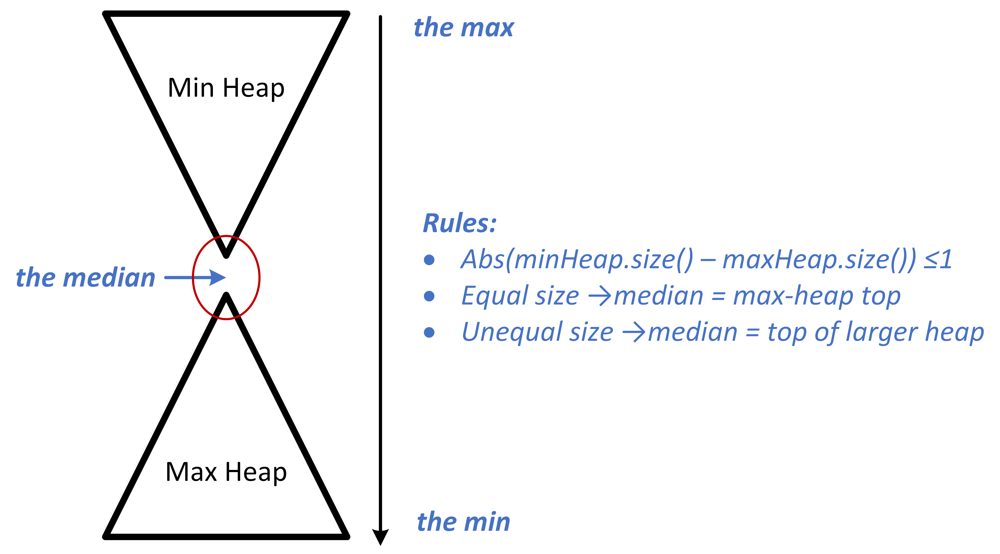

# Lecture4-Heaps

- [Lecture4-Heaps](#lecture4-heaps)
  - [what is the Priority Queues](#what-is-the-priority-queues)
  - [Binary Heap](#binary-heap)
    - [full binary tree and complete binary tree](#full-binary-tree-and-complete-binary-tree)
    - [Max Binary Heap Complexity Analysis](#max-binary-heap-complexity-analysis)
    - [build the heap, O(n) or O(nlogn)](#build-the-heap-on-or-onlogn)
    - [merge problem](#merge-problem)
    - [Code](#code)
  - [Binomial Heap](#binomial-heap)
  - [Fibonacci Heap](#fibonacci-heap)
  - [Median Heap in Homework4-Question1](#median-heap-in-homework4-question1)
    - [(a.) Data structure design](#a-data-structure-design)
    - [(b.) Algorithms (high-level description)](#b-algorithms-high-level-description)
    - [(c.) Extension: Constructor in $O(n)$](#c-extension-constructor-in-on)
    - [(d.) Code in C++ for this data structure](#d-code-in-c-for-this-data-structure)

## what is the Priority Queues

a priority queue has to perform these two operations fast!

- insert an element into the set
- find the smallest element in the set

try with some data structures:

| Implementation       | Insert | Find Min |
|----------------------|--------|----------|
| Array Implementation | O(1)   | O(n)     |
| Sorted Array         | O(n)   | O(1)     |
| Linked List          | O(1)   | O(n)     |
| Sorted Linked List   | O(n)   | O(1)     |

## Binary Heap

### full binary tree and complete binary tree

满二叉树和完全二叉树的定义。这部分我个人比较熟悉了，稍微简单略过。

**some conclusions need to remember:**

assume that a node in a complete binary tree: $i^{th}$, (root number is $1^{st}$)

- its parent: $i/2$
- its left child: $2 \cdot i \ (2\cdot i \le n, \text{otherwise it has no left child})$
- its right child: $2 \cdot i + 1 \ (2\cdot i \le n, \text{otherwise it has no right child})$

注意一下，课件上是上面的这个写法，根节点从1开始算。

一般写代码根节点是从0开始算：
- Parent(i) = (i-1)/2 （整除取整）
- Lchild(i) = 2i + 1
- Rchild(i) = 2i + 2

### Max Binary Heap Complexity Analysis

| Operation (Max Heap 大顶堆)      | Complexity | Explain |
|----------------------|--------|-------|
| find max | O(1)   | 直接取堆顶元素 |
| insert         | O(logn)   |插入到数组最后，**向上调整**|
| extract max          | O(logn)   |交换到最后，**向下调整**|
| delete   | O(logn)   |同理|
| decrease-key| O(logn)|同理|

### build the heap, O(n) or O(nlogn)

可以O(n)建堆！这个很重要。

建堆要用向下调整建，才能做到 O(n)。

### merge problem

what is the best runtime to merge two binary heaps of size n ?

可以做到 O(n).

把另一个堆数组的内容放到第一个堆的后面，然后调用建堆，此时是 O(n).

**remember:** build the heap can be O(n).

### Code

Simulate the implementation of STL `priority_queue`.

code: [stl_priority_queue.hpp](./stl_priority_queue.hpp)

## Binomial Heap

## Fibonacci Heap

## Median Heap in Homework4-Question1

### (a.) Data structure design

We maintain two heaps:

- A **max-heap** that stores the smaller half of the numbers (the “left / down” side).
- A **min-heap** that stores the larger half of the numbers (the “right / up” side).

We enforce the following invariants:

1. The size difference between the two heaps is at most 1. (Similar to the AVL tree balancing rule)
2. **If both heaps have the same size, the median is defined as the maximum element of the max-heap.**
3. If one heap has one more element than the other, the median is the top element of that heap.

This ensures that:

- **Find-median** simply returns the heap top, which is $O(1)$.
- **Insert** only requires inserting into the appropriate heap and possibly rebalancing, which is $O(\log n)$.
- **Extract-median** removes the top of the heap containing the median and rebalances if necessary, which is $O(\log n)$.

### (b.) Algorithms (high-level description)

**Insert(x):**

- Compare $x$ with the current median.
- If $x \leq$ median, insert $x$ into the max-heap; otherwise, insert into the min-heap.
- If the size difference between heaps exceeds 1, move the root from the larger heap to the smaller heap.
- Complexity: 
  - Insert operation: $O(\log n)$
  - move the root (one pop operation + one push operation): $O(\log n)$
  - therefore overall: $O(\log n)$

**Extract-Median():**

- Identify which heap contains the median (based on heap sizes).
- Remove the root of that heap.
- Complexity: $O(\log n)$ (due to heap pop operation).

### (c.) Extension: Constructor in $O(n)$

Instead of inserting elements one by one (which would cost $O(n \log n)$), it is possible to construct the two-heap data structure in linear time. The key idea is:

1. **Find the median of the input sequence in $O(n)$ time.**

   This can be done by the **median-of-medians algorithm**, which partitions the array into groups of 5, finds the median of each group, recursively computes the median of these medians, and uses it as a pivot. This guarantees a balanced partition and runs in linear time.

2. **Partition the sequence** into two subsets:

   - Elements less than or equal to the median → go into the max-heap (left / down side).
   - Elements greater than the median → go into the min-heap (right / up side).

3. **Build both heaps in $O(n)$.**

   Heap construction from an unsorted array can be done in linear time by using the bottom-up heapify procedure.

4. Ensure that the two heaps differ in size by at most one, which is guaranteed by choosing the correct number of elements on each side of the median.

Thus, the entire construction can be achieved in **$O(n)$ time**:

- Finding the median: $O(n)$

- Partitioning: $O(n)$

- Building two heaps: $O(n)$

  → Overall: $O(n)$.

### (d.) Code in C++ for this data structure

- [medianHeap.hpp](./medianHeap.hpp)