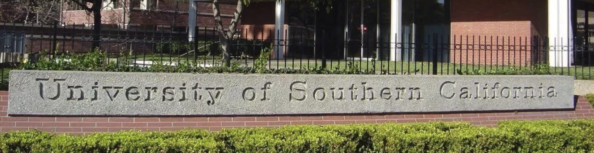

# CSCI570-Analysis-of-Algorithms-USC

Code written for lectures and homework in USC CSCI570-Analysis of Algorithms

### Lecture1 and HW1
- Matching Algorithms
- [GaleShapley Algorithm](./Lecture1-Perfect-Matching/GaleShapley.cc)

### Lecture2 and HW2
- Asymptotic Notation
- [Graph Theory](./Lecture2-BFS-DFS-Graph/README.md)

